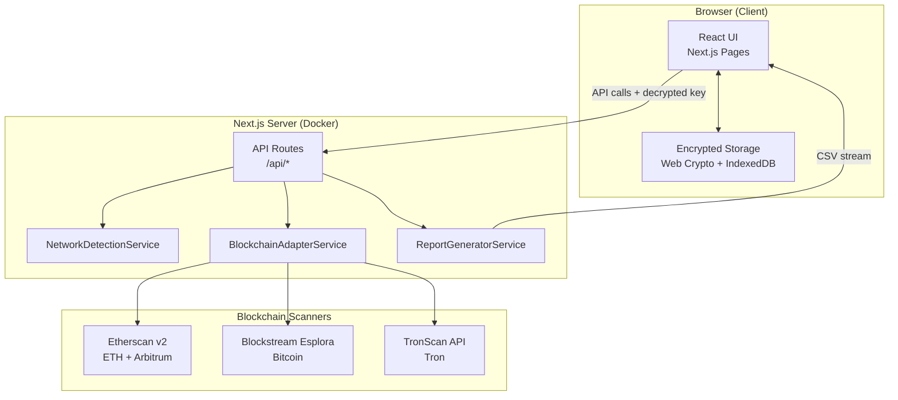
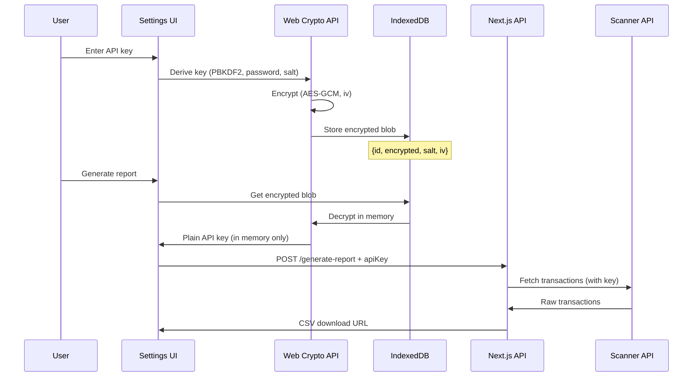

# Architecture

## Architecture Overview

### Architecture Style
**Distributed Monolith** в Monorepo — единый Next.js проект с чёткими service boundaries, готовый к разделению на микросервисы при масштабировании.

### Target Infrastructure
| Aspect | Solution |
|--------|----------|
| Pattern | Distributed Monolith (Monorepo) |
| Containers | Docker |
| Infrastructure | VPS (AdminVPS / HOSTKEY) |
| Orchestration | Coolify (self-hosted PaaS) |
| AI Integration | MCP servers (optional) |

---

## High-Level Diagram



---

## Component Breakdown

### Frontend Components
| Component | Responsibility |
|-----------|---------------|
| `AddressInput` | Input + validation + network badge |
| `DateRangePicker` | Date selection + range warnings |
| `GenerateButton` | Trigger report + progress state |
| `ReportResult` | File icon, name, size, download |
| `SettingsIntegrations` | API key management UI |
| `EncryptedKeyForm` | Key input, mask, validate, encrypt |
| `ProgressBar` | Real-time generation progress |

### Backend Services
| Service | Responsibility |
|---------|---------------|
| `NetworkDetectionService` | Address validation, regex + API probe |
| `BlockchainAdapterService` | Factory for network adapters |
| `EtherscanV2Adapter` | ETH + Arbitrum via chainid |
| `BlockstreamAdapter` | Bitcoin UTXO parsing |
| `TronScanAdapter` | Tron transactions |
| `ReportGeneratorService` | Normalize + filter + CSV generation |
| `RateLimiterService` | Request queuing, backoff |

### Client-Side Services
| Service | Responsibility |
|---------|---------------|
| `EncryptedStorageService` | AES-GCM encrypt/decrypt, IndexedDB |
| `KeyDerivationService` | PBKDF2 key derivation |
| `AutoLockService` | Inactivity timeout, memory cleanup |

---

## Technology Stack

| Layer | Technology | Rationale |
|-------|------------|-----------|
| Framework | Next.js 14+ (App Router) | Fullstack TypeScript, API Routes |
| Language | TypeScript 5.x | Type safety across stack |
| UI | React 18 + Tailwind CSS | Component model + utility CSS |
| Validation | Zod | Runtime type validation |
| HTTP Client | fetch (native) | No extra deps, built into Next.js |
| CSV Generation | Custom (no lib needed) | Simple format, ~50 lines |
| Encryption | Web Crypto API (native) | Browser-native, no npm deps |
| Client Storage | IndexedDB (via idb) | Async, structured, encrypted blobs |
| Containerization | Docker | Coolify-compatible |
| Build | Nixpacks / Dockerfile | Coolify auto-detection |
| CI/CD | Coolify auto-deploy | GitHub webhook |
| VPS | AdminVPS / HOSTKEY | Cost-effective |

---

## Monorepo Structure

```
crypto-reporter/
├── .claude/
│   └── CLAUDE.md
├── src/
│   ├── app/
│   │   ├── page.tsx                    # Main page
│   │   ├── settings/
│   │   │   └── integrations/
│   │   │       └── page.tsx            # API keys management
│   │   ├── api/
│   │   │   ├── detect-network/
│   │   │   │   └── route.ts
│   │   │   ├── generate-report/
│   │   │   │   └── route.ts
│   │   │   ├── validate-key/
│   │   │   │   └── route.ts
│   │   │   └── download/
│   │   │       └── [id]/route.ts
│   │   ├── layout.tsx
│   │   └── globals.css
│   ├── components/
│   │   ├── AddressInput.tsx
│   │   ├── DateRangePicker.tsx
│   │   ├── GenerateButton.tsx
│   │   ├── ReportResult.tsx
│   │   ├── ProgressBar.tsx
│   │   └── settings/
│   │       ├── IntegrationsPanel.tsx
│   │       └── EncryptedKeyForm.tsx
│   ├── services/
│   │   ├── network-detection.ts
│   │   ├── report-generator.ts
│   │   ├── rate-limiter.ts
│   │   └── adapters/
│   │       ├── types.ts                # BlockchainAdapter interface
│   │       ├── factory.ts              # AdapterFactory
│   │       ├── etherscan-v2.ts         # ETH + Arbitrum
│   │       ├── blockstream.ts          # Bitcoin
│   │       └── tronscan.ts             # Tron
│   ├── lib/
│   │   ├── encrypted-storage.ts        # Web Crypto + IndexedDB
│   │   ├── key-derivation.ts           # PBKDF2
│   │   ├── auto-lock.ts               # Inactivity timer
│   │   ├── csv-generator.ts
│   │   ├── address-validators.ts
│   │   └── constants.ts
│   └── types/
│       ├── transaction.ts
│       ├── network.ts
│       └── api.ts
├── Dockerfile
├── docker-compose.yml
├── next.config.js
├── tailwind.config.ts
├── tsconfig.json
├── package.json
└── README.md
```

---

## Data Architecture

### Data Flow
```
User Input → AddressInput → API /detect-network → NetworkDetectionService
                                                        ↓
User Dates → DateRangePicker → API /generate-report → BlockchainAdapterService
                                                        ↓
                                                   fetchPages (paginated)
                                                        ↓
                                                   ReportGeneratorService
                                                        ↓
                                                   normalize + filter + CSV
                                                        ↓
                                                   Temporary file → download URL
                                                        ↓
User Download ← ReportResult ← API /download/{id} ← CSV stream
```

### Temporary File Strategy
- CSV генерируется в `/tmp/reports/` на сервере
- TTL: 10 минут, затем авто-удаление (cron или setTimeout)
- Уникальный UUID для каждого отчёта
- Нет персистентного хранения — stateless

---

## Client-Side Secrets Management

### Flow


### Security Measures
- **PBKDF2** key derivation (100k iterations, SHA-256)
- **Unique salt** per installation (16 bytes random)
- **Unique IV** per encryption operation (12 bytes random)
- **AES-GCM 256-bit** — authenticated encryption
- **Auto-lock** on inactivity (configurable, default 15 min)
- **No server-side key storage** — ключи существуют только в IndexedDB (зашифрованные) и в памяти (при использовании)
- **Memory cleanup** — derived key cleared on lock/tab close

---

## Docker Configuration

### Dockerfile
```dockerfile
FROM node:20-alpine AS base

FROM base AS deps
WORKDIR /app
COPY package.json package-lock.json ./
RUN npm ci --production=false

FROM base AS builder
WORKDIR /app
COPY --from=deps /app/node_modules ./node_modules
COPY . .
RUN npm run build

FROM base AS runner
WORKDIR /app
ENV NODE_ENV=production
RUN addgroup --system --gid 1001 nodejs
RUN adduser --system --uid 1001 nextjs
COPY --from=builder /app/public ./public
COPY --from=builder --chown=nextjs:nodejs /app/.next/standalone ./
COPY --from=builder --chown=nextjs:nodejs /app/.next/static ./.next/static
USER nextjs
EXPOSE 3000
ENV PORT=3000
CMD ["node", "server.js"]
```

### docker-compose.yml
```yaml
version: '3.8'
services:
  app:
    build: .
    ports:
      - "3000:3000"
    environment:
      - NODE_ENV=production
    restart: unless-stopped
    healthcheck:
      test: ["CMD", "curl", "-f", "http://localhost:3000/api/health"]
      interval: 30s
      timeout: 10s
      retries: 3
```

---

## Coolify Deployment

### Configuration
| Setting | Value |
|---------|-------|
| Build Pack | Dockerfile |
| Port | 3000 |
| Base Directory | / |
| Watch Paths | ** |
| Auto Deploy | Enabled (GitHub webhook) |
| Health Check | /api/health |

### Environment Variables (Coolify UI)
```
NODE_ENV=production
NEXT_TELEMETRY_DISABLED=1
```

Note: API ключи сканеров НЕ хранятся как env vars — они в браузере пользователя.

---

## Scalability Path

### Current (MVP): Single Container
```
[Coolify] → [Docker: Next.js (API + Frontend)]
```

### Future (v2): Distributed Monolith
```
[Coolify] → [Docker: Frontend (Next.js)]
         → [Docker: API Service (Node.js)]
         → [Docker: Worker (Report Generation)]
         → [Docker: Redis (Queue + Cache)]
```

Выделение в отдельные контейнеры через Coolify resources с shared network.

---

*Generated with SPARC Architecture phase*
