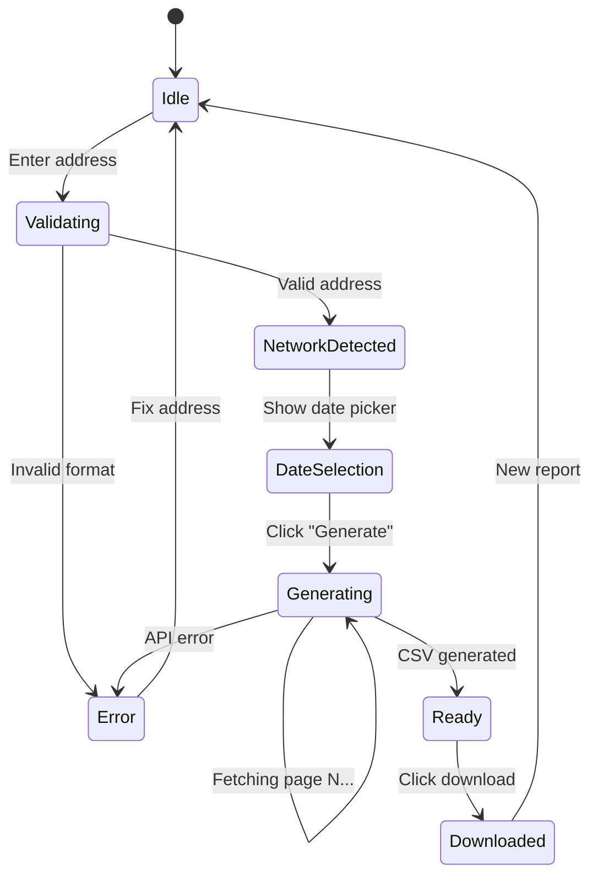

# Pseudocode

## Data Structures

### Transaction (normalized)
```typescript
type Transaction = {
  date: string           // ISO 8601 UTC
  txHash: string         // Transaction hash
  direction: 'IN' | 'OUT'
  from: string           // Sender address
  to: string             // Receiver address
  amount: string         // Decimal string, base token unit
  token: string          // Symbol (ETH, BTC, TRX, etc.)
  network: string        // ethereum, bitcoin, tron, arbitrum
  fee: string            // Native currency fee
  txUrl: string          // Link to block explorer
}
```

### ReportRequest
```typescript
type ReportRequest = {
  address: string
  network: Network
  dateFrom: Date
  dateTo: Date
  apiKey?: string        // Decrypted in client memory
}
```

### EncryptedSecret
```typescript
type EncryptedSecret = {
  id: string             // e.g. "etherscan", "tronscan"
  encryptedData: ArrayBuffer
  salt: Uint8Array       // Unique per secret
  iv: Uint8Array         // Unique per encryption
}
```

### Network
```typescript
type Network = 'ethereum' | 'bitcoin' | 'tron' | 'arbitrum'

type NetworkConfig = {
  name: string
  chainId?: number       // For Etherscan v2
  explorerUrl: string
  apiBaseUrl: string
  addressRegex: RegExp
  requiresApiKey: boolean
}
```

---

## Core Algorithms

### Algorithm: detectNetwork
```
INPUT: address (string)
OUTPUT: Network | Error

STEPS:
1. TRIM and normalize address
2. IF address matches /^0x[0-9a-fA-F]{40}$/:
     → Could be Ethereum or Arbitrum
     → TRY Etherscan v2 with chainid=1 (Ethereum first)
     → IF found: RETURN "ethereum"
     → TRY Etherscan v2 with chainid=42161 (Arbitrum)
     → IF found: RETURN "arbitrum"
3. IF address matches /^(bc1|[13])[a-zA-HJ-NP-Z0-9]{25,62}$/:
     → RETURN "bitcoin"
4. IF address matches /^T[a-zA-Z0-9]{33}$/:
     → RETURN "tron"
5. RETURN Error("UNSUPPORTED_NETWORK")

COMPLEXITY: O(1) for regex, O(1) for API probe (max 2 calls)
```

### Algorithm: fetchTransactions
```
INPUT: address, network, dateFrom, dateTo, apiKey?
OUTPUT: Transaction[]

STEPS:
1. GET adapter = AdapterFactory.create(network)
2. SET allTx = []
3. SET cursor = null
4. LOOP:
     a. rawPage = adapter.fetchPage(address, cursor, apiKey)
     b. IF rawPage is empty: BREAK
     c. normalized = rawPage.map(tx => adapter.normalize(tx))
     d. filtered = normalized.filter(tx =>
          tx.date >= dateFrom AND tx.date <= dateTo)
     e. allTx.push(...filtered)
     f. IF oldest tx in rawPage < dateFrom: BREAK (optimization)
     g. cursor = adapter.getNextCursor(rawPage)
     h. AWAIT rateLimitDelay(network)
5. SORT allTx by date DESC
6. RETURN allTx

COMPLEXITY: O(n) where n = total transactions / page size
RATE LIMIT: 200ms delay between Etherscan calls, none for Blockstream
```

### Algorithm: generateCSV
```
INPUT: transactions (Transaction[])
OUTPUT: CSV string

STEPS:
1. SET headers = ["Date","Tx Hash","Direction","From","To","Amount","Token","Network","Fee","Tx URL"]
2. SET rows = [headers.join(",")]
3. FOR EACH tx IN transactions:
     a. SET row = [
          tx.date,
          tx.txHash,
          tx.direction,
          tx.from,
          tx.to,
          tx.amount,
          tx.token,
          tx.network,
          tx.fee,
          tx.txUrl
        ]
     b. escaped = row.map(field => escapeCSV(field))
     c. rows.push(escaped.join(","))
4. RETURN rows.join("\n")

COMPLEXITY: O(n)
```

### Algorithm: encryptApiKey (Client-Side)
```
INPUT: apiKey (string), userPassword (string)
OUTPUT: EncryptedSecret

STEPS:
1. SET salt = crypto.getRandomValues(new Uint8Array(16))
2. SET keyMaterial = await crypto.subtle.importKey(
     "raw", encode(userPassword), "PBKDF2", false, ["deriveKey"])
3. SET derivedKey = await crypto.subtle.deriveKey(
     { name: "PBKDF2", salt, iterations: 100000, hash: "SHA-256" },
     keyMaterial,
     { name: "AES-GCM", length: 256 },
     false,
     ["encrypt", "decrypt"])
4. SET iv = crypto.getRandomValues(new Uint8Array(12))
5. SET encryptedData = await crypto.subtle.encrypt(
     { name: "AES-GCM", iv },
     derivedKey,
     encode(apiKey))
6. STORE in IndexedDB: { id, encryptedData, salt, iv }
7. KEEP derivedKey in memory for session
8. SET auto-lock timer

COMPLEXITY: O(1), ~100ms for PBKDF2 100k iterations
```

### Algorithm: decryptApiKey (Client-Side)
```
INPUT: secretId (string), userPassword (string)
OUTPUT: apiKey (string)

STEPS:
1. GET { encryptedData, salt, iv } FROM IndexedDB WHERE id = secretId
2. DERIVE key from userPassword using same PBKDF2 params
3. SET decrypted = await crypto.subtle.decrypt(
     { name: "AES-GCM", iv }, key, encryptedData)
4. RETURN decode(decrypted)

NOTES: Key stays in memory only. Auto-cleared on timeout.
```

---

## Blockchain Adapter Interface

```typescript
interface BlockchainAdapter {
  network: Network
  fetchPage(address: string, cursor: string | null, apiKey?: string): Promise<RawTransaction[]>
  normalize(raw: RawTransaction): Transaction
  getNextCursor(page: RawTransaction[]): string | null
  getTxUrl(txHash: string): string
  getRateLimitMs(): number
}
```

### EtherscanV2Adapter
```
fetchPage(address, cursor, apiKey):
  url = "https://api.etherscan.io/v2/api"
  params = {
    chainid: this.chainId,  // 1 for ETH, 42161 for Arbitrum
    module: "account",
    action: "txlist",
    address: address,
    startblock: 0,
    endblock: 99999999,
    page: cursor || 1,
    offset: 100,
    sort: "desc",
    apikey: apiKey
  }
  RETURN response.data.result

normalize(raw):
  RETURN {
    date: new Date(raw.timeStamp * 1000).toISOString(),
    txHash: raw.hash,
    direction: raw.to.toLowerCase() === address.toLowerCase() ? 'IN' : 'OUT',
    from: raw.from,
    to: raw.to,
    amount: formatUnits(raw.value, 18),  // wei → ETH
    token: this.chainId === 1 ? 'ETH' : 'ETH',  // Arbitrum also uses ETH
    network: this.network,
    fee: formatUnits(BigInt(raw.gasUsed) * BigInt(raw.gasPrice), 18),
    txUrl: this.getTxUrl(raw.hash)
  }
```

### BlockstreamAdapter (Bitcoin)
```
fetchPage(address, cursor):
  url = `https://blockstream.info/api/address/${address}/txs`
  IF cursor: url += `/chain/${cursor}`
  RETURN response.data  // Array of 25 txs

normalize(raw):
  // Bitcoin UTXO: check if address is in inputs or outputs
  SET isInput = raw.vin.some(v => v.prevout?.scriptpubkey_address === address)
  SET isOutput = raw.vout.some(v => v.scriptpubkey_address === address)
  SET direction = isInput ? 'OUT' : 'IN'
  SET amount = calculateAmount(raw, address, direction)
  RETURN {
    date: new Date(raw.status.block_time * 1000).toISOString(),
    txHash: raw.txid,
    direction,
    from: direction === 'OUT' ? address : getMainInput(raw),
    to: direction === 'IN' ? address : getMainOutput(raw),
    amount: satoshiToBtc(amount),
    token: 'BTC',
    network: 'bitcoin',
    fee: satoshiToBtc(raw.fee),
    txUrl: `https://blockstream.info/tx/${raw.txid}`
  }

getNextCursor(page):
  IF page.length < 25: RETURN null
  RETURN page[page.length - 1].txid
```

### TronScanAdapter
```
fetchPage(address, cursor):
  url = "https://apilist.tronscanapi.com/api/transaction"
  params = {
    address: address,
    start: cursor || 0,
    limit: 50,
    sort: "-timestamp"
  }
  RETURN response.data.data

normalize(raw):
  RETURN {
    date: new Date(raw.timestamp).toISOString(),
    txHash: raw.hash,
    direction: raw.toAddress === address ? 'IN' : 'OUT',
    from: raw.ownerAddress,
    to: raw.toAddress,
    amount: formatTrx(raw.amount),
    token: raw.tokenInfo?.tokenAbbr || 'TRX',
    network: 'tron',
    fee: formatTrx(raw.cost?.fee || 0),
    txUrl: `https://tronscan.org/#/transaction/${raw.hash}`
  }
```

---

## State Transitions



---

## Error Handling Strategy

| Error Category | HTTP Code | User Message | Recovery |
|---------------|-----------|--------------|----------|
| Invalid address | 400 | "Неверный формат адреса" | Fix input |
| Unsupported network | 400 | "Сеть не поддерживается" | Try other address |
| Rate limit | 429 | "Превышен лимит. Добавьте свой API ключ" | Settings → add key |
| Scanner API down | 502 | "Сканер временно недоступен" | Retry later |
| No transactions | 404 | "Транзакции не найдены" | Check dates/address |
| Encryption error | 500 | "Ошибка шифрования" | Re-enter password |
| Timeout | 504 | "Превышено время ожидания" | Narrow date range |

---

*Generated with SPARC Pseudocode phase*
